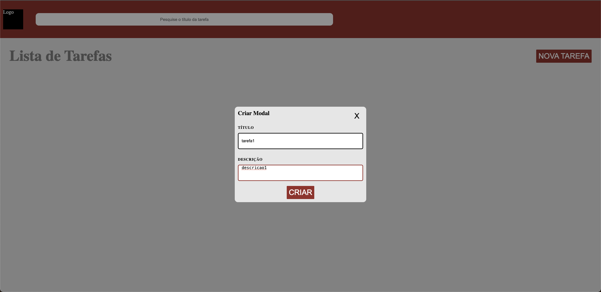
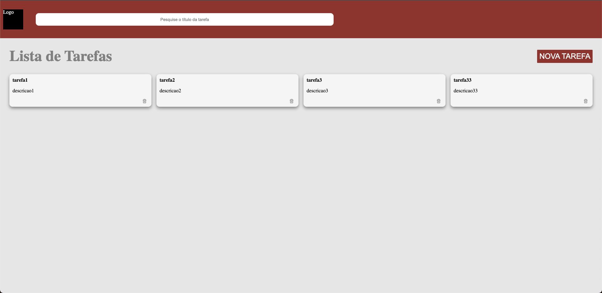
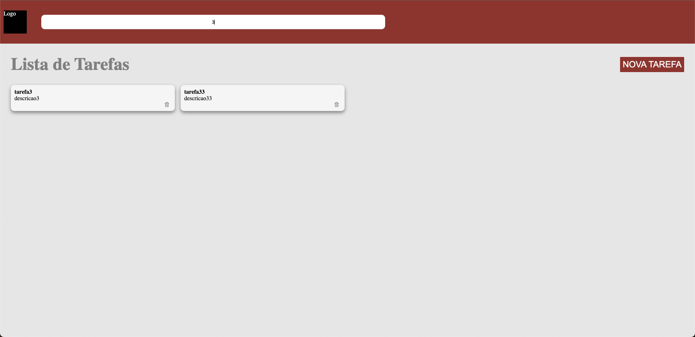

# Mini Projeto Javascript
### Modulo 2

## Descricao

- Lista de tarefas iterativa
- Criar e excluir tarefas
- Buscar tarefas
- Utilizacao de JSON como "banco de dados"

## Funcionalidades

[x] Criar Tarefas
[x] Excluir Tarefas
[x] Buscar por tarefas pelo titulo 
[ ] Buscar por tarefas pela descricao
[ ] Responsividade
[x] Script para rodar "backend" e frontend simultaneamente

## Imagens

### Tela Inicial ( Sem Tarefas )

### Tela De Criar Tarefa

### Tela com Tarefas Criadas

### Tela com Tarefas Filtradas pela Barra de Pesquisa

